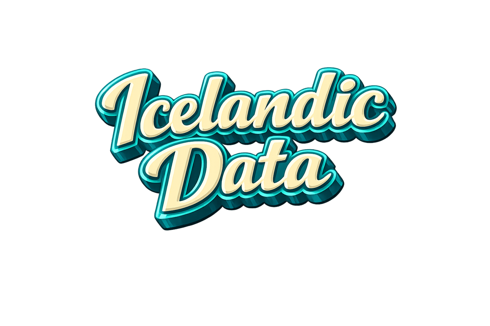

# Icelandic Data



[](https://github.com/jokull/icelandic-data/actions/workflows/source-health.yml)
[](https://github.com/jokull/icelandic-data/actions/workflows/ci.yml)

Data toolkit for Icelandic public data. The `.agents/skills/` files document each data source — API endpoints, series codes, encoding quirks, classification changes — and the `scripts/` directory has Python scripts that fetch, clean, and transform the data. It's harness-agnostic: any agent that can read the skills and run the scripts they reference (Claude Code, Codex, and others) works.

<blockquote>
  <p>“I spent a good chunk of my career, including an entire startup, DataMarket, making public data accessible. This project cracks the problem from the angle I now believe is the right one: <strong>don't build another portal, make the data agent-ready.</strong> Ask a question in plain language and watch it pull together answers from dozens of official sources. I've been showing it to people in government as a direct demonstration of what such an approach can deliver.”</p>
  <p>
    <a href="https://hjalli.com/about/"></a>
    &nbsp; <strong><a href="https://hjalli.com/about/">Hjálmar Gíslason</a></strong><br>
    &nbsp; Founder &amp; CEO of GRID<br>
    &nbsp; Previously founder of DataMarket (acquired by Qlik)
  </p>
</blockquote>

The **data sources** badge reports upstream health, not this repo's code: a source only turns it
red after **7 straight days** down or returning the wrong shape. Anything shorter is weather —
these are public APIs and they blink. Details in
[`AGENTS.md`](AGENTS.md#flake-vs-dead); raw history is on the
[`health-history`](https://github.com/jokull/icelandic-data/tree/health-history) branch.

Not a portable skill library. The skills reference co-located scripts and work as a unit. Get the repo, run setup, and use an agent to research questions, join data sources, or produce outputs — a gist, a CSV, an HTML report, whatever fits. It is plain Python and runs on macOS, Linux and Windows.

## Structure

```
.agents/skills/{source}/SKILL.md → Data source docs (API, endpoints, caveats)
scripts/{source}.py              → Fetch + transform scripts
tests/health/test_{source}.py    → Upstream health probes (marker: health)
data/raw/{source}/               → Raw downloads
data/processed/                  → Cleaned datasets
```

Skills follow the [agentskills.io](https://agentskills.io) open standard. `.agents/skills/`
is the real location (read natively by Codex); `.claude/skills` symlinks to it for Claude
Code, and `CLAUDE.md` symlinks to `AGENTS.md`. One set of files, both agents.

## Data sources

Currently 56 skills covering national statistics, government dashboards
(_mælaborð_), regulatory filings, and utility APIs. Each skill's frontmatter
`description` is its index entry — run `ls .agents/skills/` to enumerate them, and see
[`AGENTS.md`](AGENTS.md) for the quick-commands reference.

The light in each row is that source's current verdict, refreshed daily and finer-grained
than the badge above (which waits a full week before going red):
 healthy ·
 flaky (failed but recovered — these APIs blink) ·
 dead, or the skill no longer matches the source ·
 not enough observations yet.
A `·` means there is [nothing upstream to probe](tests/health/README.md#skills-with-no-upstream-to-probe).
Per-source uptime and last error are in the
[workflow summary](https://github.com/jokull/icelandic-data/actions/workflows/source-health.yml).

### Statistics & macroeconomic

| | Source | Description |
|---|--------|-------------|
|  | Hagstofa Íslands | PX-Web API — economic, demographic, trade, income series |
|  | Seðlabanki | SDMX API — monetary policy, financial stability, FX history via ECB |
|  | Seðlabanki (FX) | Central Bank FX intervention — gjaldeyriskaup/-sala, turnover, reserves, ISK/EUR (monthly) |
|  | Lánamál ríkisins | Government bond yields — RIKB/RIKS daily fixings, no auth (lanamal.is) |
|  | Tekjusagan | Income-history dashboard — 5 Power BI report routes (Forsætisráðuneytið) |
|  | Velsældarvísar | Hagstofa indicator catalogs — well-being + social + cultural (88 indicators → 77 PX tables) |
|  | Heimsmarkmið | UN SDG national statistics — 137 indicators across all 17 goals (open-sdg ZIP bundle) |
|  | Ríkisreikningur | State accounts — yearly afkoma 2015+, málefnasvið breakdowns, 35 published files (Azure Functions API) |
|  | Fjárlög | State budget appropriations + 5-year plan at málaflokkur level (actual / enacted / bill) |
|  | Energy | Electricity generation by source, energy-system tables and fuel sales (Environment & Energy Agency) |
|  | Alþingi | Parliamentary XML — MPs, per-MP vote records, bills, committees, speeches (1875+) |
|  | Eurostat | Euro-area / EU statistics — HICP, compensation of employees, employment, labour costs (official REST API) |
|  | Housing completions | Completed dwellings 1970–2025 — Hagstofan IDN03001 + HMS húsnæðisáætlanir |
|  | Income distribution | Hagstofan TEK01001 — mean/median income by source, age, gender + tax burden (1990–2024) |

### Government dashboards (_mælaborð_)

Systematic coverage of public dashboards published under Iceland's data-access law.

| | Source | Description |
|---|--------|-------------|
|  | Landlæknir | 33 Directorate-of-Health Power BI dashboards + Talnabrunnur PDFs |
|  | Vinnumálastofnun | Registered unemployment — Power BI + monthly Excel |
|  | Farsæld barna | Child-wellbeing dashboard (static-data Power BI) |
|  | Mælaborð landbúnaðarins | 3 Power BI dashboards — subsidies, livestock, markets |
|  | Ferðamálastofa | Keflavík passengers, flights, accommodation — Power BI scraping |
|  | Umferð (Vegagerðin) | 168+ traffic counters — real-time 15-min + 7-day rolling daily |
|  | Byggðastofnun | Regional-development dashboards — 11 Tableau Public embeds (population, income, energy, grants) |
|  | Vernd (Ríkislögreglustjóri) | Asylum / international-protection monthly stats — Power BI |

### Business & markets

| | Source | Description |
|---|--------|-------------|
|  | Skatturinn | Annual reports (ársreikningar), company registry, ownership chains |
| · | Financials | PDF-to-structured extraction via `pdfplumber` + Claude interpretation |
|  | Nasdaq Iceland | Exchange notices, annual reports, insider trading |
| · | Insurance | 4 insurers (Sjóvá, Skagi/VÍS, TM, Vörður), combined ratios, Nordic comparison |
|  | Fuel | Gasvaktin prices + conglomerate financials for N1/Olís/Orkan/Atlantsolía |
|  | Maskína | Public-opinion polls via Tableau Public VizQL + WordPress API |
|  | Skoðanakannanir | RÚV opinion-poll aggregator — national + Reykjavík party support across pollsters |
|  | Opnir reikningar | Government invoices by org/vendor/type, 2017–present |
|  | Tenders | 3,494+ public tenders via TED API + OCDS bulk data |

### Property, planning, addresses

| | Source | Description |
|---|--------|-------------|
|  | HMS | Kaupskrá fasteigna (222k transactions, geocoded) + Landeignaskrá (89k parcel polygons) |
|  | Skipulagsmál (Planitor) | Planning & building permits — cases, minutes, entities, nearby search across 5 municipalities |
| · | iceaddr | Icelandic address geocoding (bundled SQLite from Staðfangaskrá) |

### Transport & mobility

| | Source | Description |
|---|--------|-------------|
|  | Samgöngustofa | Vehicle registrations by make, fuel type, location — Power BI |
|  | car (island.is) | Per-vehicle lookup by plate/VIN via public GraphQL API |

### Environment & geography

| | Source | Description |
|---|--------|-------------|
|  | Veður | Met-Office JSON API — observations, stations, forecasts, earthquakes |
|  | Loftgæði | UST air quality — PM10/PM2.5/NO2/H2S, 57 stations, hourly |
|  | CO2 (co2.is) | Climate action plan — 106 numbered actions across 4 kerfi, status + ministry + year tracking |
|  | LMI | Vector geodata via GeoServer WFS — coastline, roads, rivers, glaciers |
|  | LMI HRL | Copernicus High Resolution Layers via LMI — grassland, imperviousness (20 m raster) |
|  | Náttúrufræðistofnun | Habitat-type polygons (vistgerðir) via WFS |
|  | EEA SDI | European Environment Agency geospatial catalogue (GeoNetwork 4.4) |
|  | UST GIS | Environment Agency WFS — contaminated land, water, protected areas, noise and wastewater |
| · | Kortagerð | Iceland map generation — matplotlib (static) + Leaflet (interactive) |

### Energy & fisheries

| | Source | Description |
|---|--------|-------------|
|  | Hafrannsóknastofnun | Annual fish-stock assessments, advice, landings and survey series (embedded table JSON) |
|  | Fiskistofa | Open WFS layers for active fishing closures, regulations and fishing areas (not paid catch/quota REST) |

### Personal finance & rates

| | Source | Description |
|---|--------|-------------|
|  | Laun (payday.is) | Take-home salary calculator with tax/pension breakdown |
|  | Gengi (Borgun) | Currency exchange rates (card rates, not interbank) |

### Legal & civic

| | Source | Description |
|---|--------|-------------|
|  | Dómstólar | Court rulings — Héraðsdómstólar, Landsréttur, Hæstiréttur via RSS + scraping |
|  | Reykjavíkurborg | CKAN + PX-Web APIs for municipal services, demographics, welfare, Opin Fjármál |

## Setup

You need a terminal once, for setup. After that, an agent does the typing.

1. **Get the repo.** `git clone https://github.com/jokull/icelandic-data` — or, without
   git, use **Code → Download ZIP** on GitHub and unzip it. (The Code tab in Claude
   Desktop needs [Git for Windows](https://git-scm.com/download/win) installed on
   Windows even for a ZIP checkout; Claude Code CLI and Codex do not.)
2. **Run setup.** It installs [`uv`](https://docs.astral.sh/uv/) if you don't have it,
   which then downloads Python and every dependency. Nothing else is required — no
   Homebrew, no system Python.

   ```bash
   ./setup.sh                                          # macOS / Linux
   powershell -ExecutionPolicy Bypass -File .\setup.ps1  # Windows
   ```

   Setup ends by running `scripts/setup_check.py`, which reports what works and
   repairs the `.claude/skills` link if git or the ZIP download flattened it.
   (On Windows that repair is a junction, and `git status` will show `.claude/skills`
   as changed from then on — expected, do not revert it.)
3. **Open the folder in your agent.** Claude Code, Codex, the Code tab in Claude
   Desktop, or ChatGPT Desktop (Codex) all read the skills from the repo. Ask a question
   such as *"What is the median price per m² of apartments in Reykjavík since 2020?"*
   Codex asks whether to trust the folder the first time — say yes. That loads
   `.codex/config.toml`, which lets the sandbox reach the Icelandic APIs; without it
   every fetch fails with a DNS error.

That is **Tier 0** and covers 41 of the 56 skills. The rest need one more
opt-in install; each skill says which at the top of its `SKILL.md`:

| Tier | Install | Unlocks |
|---|---|---|
| 0 core | `uv sync` | statistics, dashboards, registers, finance, polls, weather — plain Python |
| 1 maps | `uv sync --group maps` | map rendering and rasters (kortagerð, LMI, NÍ habitats, traffic/cattle maps) |
| 2 browser | `uv run playwright install chromium` | Power BI / Tableau / JS-rendered scrapers |
| 3 pdf | `uv sync --group pdf` | Docling AI table extraction (pulls in torch, ~2 GB) |
| 4 restricted | — | needs an Icelandic IP or private credentials; documented, not portable |

`scripts/setup_check.py` prints which tiers are installed.

### What a first run looks like

Measured on a fresh macOS user account and a bare Ubuntu container, both with only
`curl` on PATH: `setup.sh` finishes in 20–30 s, the environment is about 500 MB, and
the maps tier adds a couple of seconds. Where newcomers can stall, and the fix:

| Stops at | Why | Fix |
|---|---|---|
| Claude Desktop Code tab on Windows | needs Git for Windows | install Git, restart the app |
| PowerShell refuses `setup.ps1` | execution policy | run it as shown above, with `-ExecutionPolicy Bypass` |
| `uv: command not found` right after install | new PATH not in the current shell | open a new terminal, or re-run `setup.sh` |
| Codex: every fetch fails with a DNS error | sandbox has no network until the folder is trusted | trust the folder when asked |
| Power BI / Tableau skill fails to start a browser | Tier 2 not installed | `uv run playwright install chromium` |
| A map script exits asking for the maps tier | Tier 1 not installed | `uv sync --group maps` |
| Samgöngustofa times out | geo-fenced to Icelandic IPs | run from Iceland or skip |
 On Windows `setup.ps1`
sets `PYTHONUTF8=1` for your user account so Icelandic characters print correctly.

Every command in the docs is of the form `uv run python scripts/<name>.py ...` and
works the same in bash, zsh, fish and PowerShell. SQL against the processed files
goes through `uv run python scripts/sql.py "SELECT ..."`, so no DuckDB binary is needed.

## Usage

```bash
# Process data
uv run python scripts/sedlabanki.py
uv run python scripts/fuel.py

# Query with DuckDB
uv run python scripts/sql.py "SELECT * FROM 'data/processed/fuel_prices_daily.csv' LIMIT 10"

# Company financials pipeline
uv run python scripts/financials.py company <kennitala> --year 2024

# Scrape a government dashboard
uv run python scripts/landlaeknir.py list
uv run python scripts/landlaeknir.py fetch --slug mortis

# Build the indicator catalog for visar.hagstofa.is
uv run python scripts/velsaeldarvisar.py fetch
```

See [AGENTS.md](AGENTS.md) for the full command catalog across every skill.

## Tests

```bash
uv run pytest -m "not slow"   # fast unit tests (~0.5s) — what PR CI runs
uv run pytest -m slow         # network + Playwright tests (several minutes)
uv run pytest -m health       # upstream health probes
uv run pytest -m health -k hagstofan   # probe one source
```

Health probes check that each upstream source still serves the smallest contract
its script depends on. They run daily in CI; browser-based probes are
manual-dispatch only. See [`.github/workflows/source-health.yml`](.github/workflows/source-health.yml).

## Adding a new data source

See the [`new-data-source` skill](.agents/skills/new-data-source/SKILL.md) for
the methodology — discovery, probing, skill authoring, script conventions,
testing, and visualization.
